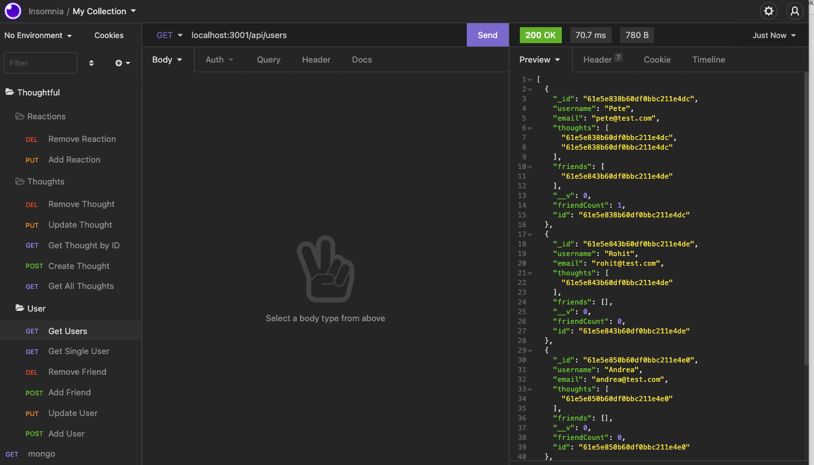
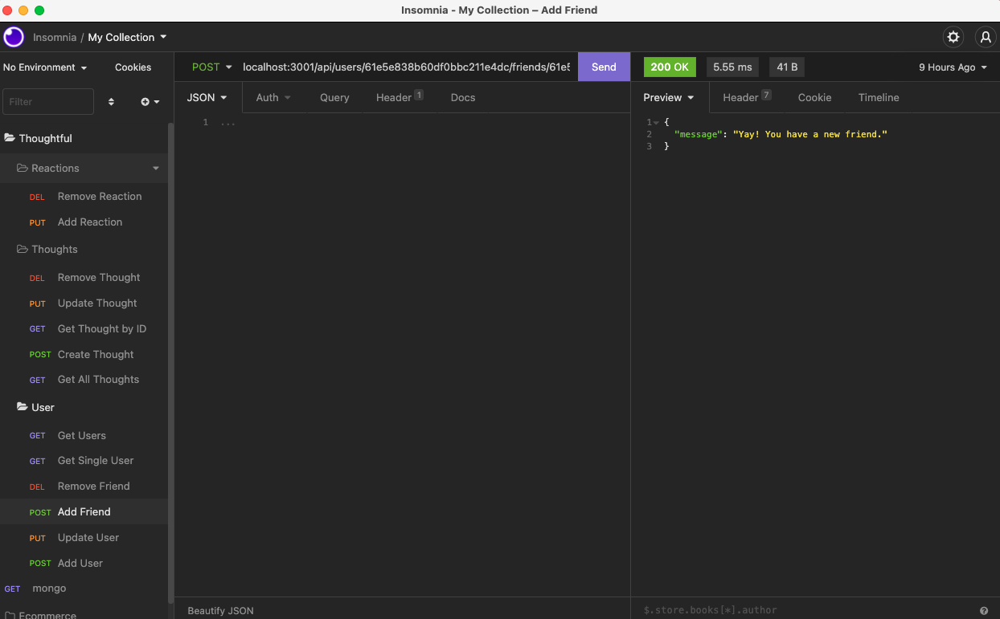
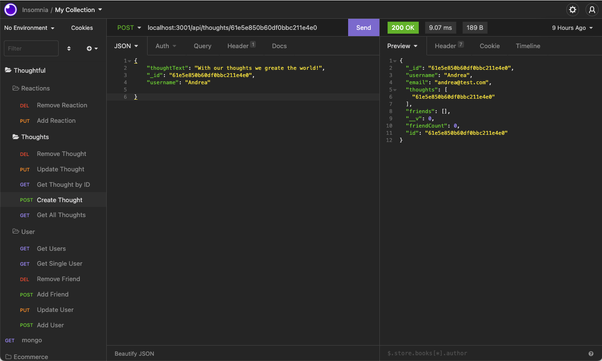
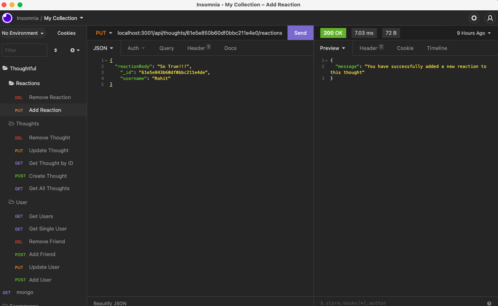

# Thoughtful (Social Network API)

---

## Table of Contents

1.  [Description](#Description)
2.  [Installation](#Installation)
3.  [Usage](#Usage)
4.  [License](#License)
5.  [Contributing](#Contributing)
6.  [Questions](#Questions)

 

## Description

Thoughtful is a social network API that uses Express.js, NoSGL, MongoDB and Mongoose.
It allows the user to create, get, update and delete an account. They can then add other users to their friends list.
They may also add, update and delete a thought or add and delete a reaction to another users thought.

 

## Installation

_Please clone the github repository and then run: `npm i` to install the dependencies_
_Node.js is also required to run this app._

  

## Usage

Open an integrated terminal and run: `node index.js` to start the server.

You will also need Insomnia and MongoDBCompass to use this app .

You will now be connected to the server and listening to the local host and able to start using the routes in Insomnia.

 

## License

This application has the following license:
[MIT License](https://opensource.org/licenses/MIT)

 

## Contributing

Please email me to discuss further.

 

## Questions

_If you would like to know more or have a question you'd like to ask, please contact me via email marc.malliate@gmail.com or you may also like to checkout my work [here](https://github.com/marcmalliate)_

 

### You may also like to view the GitHub repository which contains the code repository:

https://github.com/marcmalliate/thoughtful

 

### Screenshot of application:

GET Users:

POST Friend:

POST Thought:

PUT Reaction:

For a more detailed demonstration please watch the 2 videos below

 

### Video demonstration of application:

Please note, this video demonstration is split into 2 parts.

PART 1

https://watch.screencastify.com/v/jaZeUOBQUZMOcGslSjLD

PART 2

https://watch.screencastify.com/v/3wcGaueLcrByPrUGV2z8
 

© _2021 Marc Malliate - Professional Readme Generator_
